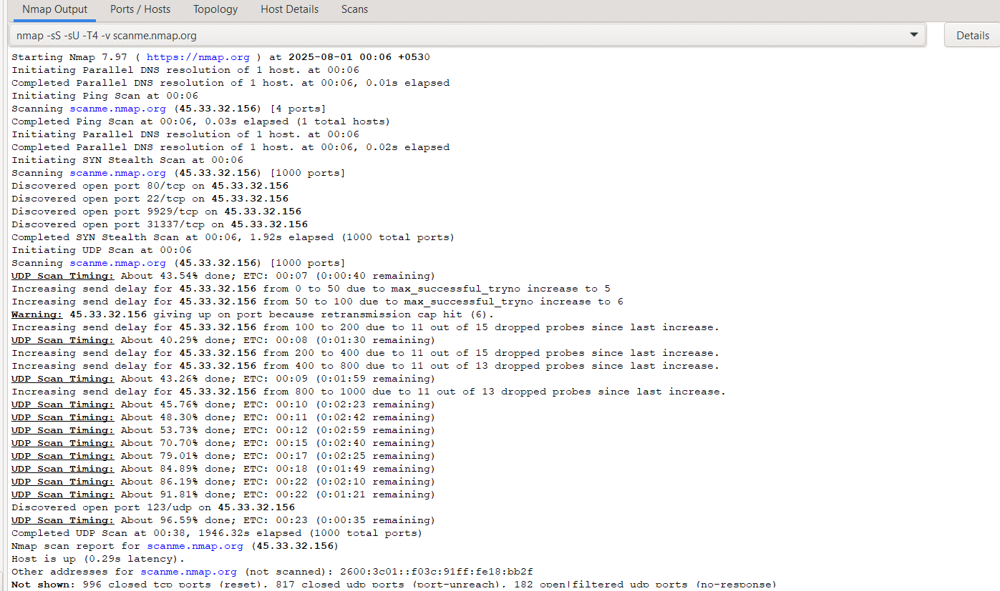

# 🐧 Linux Assistant Bot using Groq API

This project is part of an Ethical Hacking assignment. It involves building a Python-based bot that accepts Linux-related questions from the user and fetches intelligent responses using the Groq API with the `llama3-70b-8192` language model.

---

## 📌 Project Overview

- **Purpose**: Simulate a Linux assistant bot using an LLM.
- **Input**: A question related to Linux (e.g., "How to list hidden files in Linux?")
- **Output**: A detailed answer fetched from the Groq AI API.
- **Platform**: Runs via Python in the terminal (Windows/Linux/macOS supported).
- **API Used**: Groq `chat/completions` endpoint with `llama3-70b-8192` model.

---

## ⚙️ Setup Instructions

### 1. Clone or Download the Repository

If using Git:
```bash
git clone https://github.com/your-username/linux-groq-bot.git
cd linux-groq-bot
```
Or just download the `.py` script directly.

---

### 2. Install Required Python Packages

Ensure you have Python 3.7+ installed.

Install the required module:
```bash
pip install requests
```

---

### 3. Add Your Groq API Key

Replace the placeholder in your script with your actual API key:

```python
headers = {
    "Authorization": "Bearer YOUR_GROQ_API_KEY",
    "Content-Type": "application/json"
}
```

You can get your key from: [https://console.groq.com/keys](https://console.groq.com/keys)

---

## 🚀 How to Use

Run the bot from your terminal:

```bash
python groq_linux_bot.py
```

Then type your Linux question when prompted:
```
Ask your Linux question: How to list hidden files in Linux?
```

The bot will return a helpful explanation with command examples, like:
```bash
ls -a
ls -A
ls -d .*
find -name '.*'
ls | grep '^\.'
```

---

## 🖼️ Example Output Screenshot




---

## 📝 Notes

- If you get errors like `invalid_api_key` or `model_decommissioned`, make sure:
  - Your API key is correct and active.
  - You're using the supported model: `llama3-70b-8192`.

- Some Linux distros alias `ls`, so default output might ignore hidden files. Use:
  ```bash
  alias ls='ls -a'
  ```

---

## 📄 License

This project is for educational purposes only under university Ethical Hacking coursework.

---

## 👨‍💻 Author

**Tenzin Rigzin**  
BTech CSE | Christ University  
July 2025 – Semester 3  
